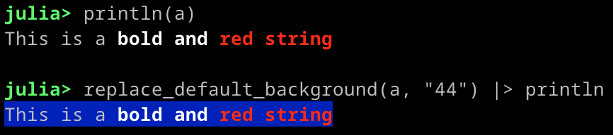
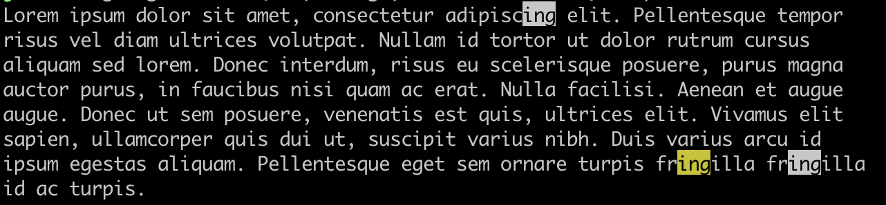

# StringManipulation.jl

[](https://github.com/ronisbr/StringManipulation.jl/actions/workflows/ci.yml)
[](https://codecov.io/gh/ronisbr/StringManipulation.jl)
[](https://github.com/invenia/BlueStyle)
[](https://zenodo.org/badge/latestdoi/421645319)

This package has the purpose to provide functions to manipulate strings with ANSI escape
sequences.

## Alignment

The function `align_string` can be used to align the string in a field with a specific size
to the left, center, or right.

```julia
julia> align_string(
       "A string with emojis 😃😃 and \e[4mdecoration\e[0m to be aligned",
       80,
       :c
       ) |> print
             A string with emojis 😃😃 and decoration to be aligned

julia> align_string(
       "A string with emojis 😃😃 and \e[4mdecoration\e[0m to be aligned",
       80,
       :r
       ) |> print
                          A string with emojis 😃😃 and decoration to be aligned
```

If the string has multiple lines, then all can be aligned at once using the function
`align_string_per_line`.

```julia
julia> str = """
       We have \e[38;5;231;48;5;243mhere\e[0m 😅😃 the first line
       We now have the 😊 \e[38;5;231;48;5;243msecond\e[0m 😃 line""";

julia> align_string_per_line(str, 80, :r) |> print
                                                We have here 😅😃 the first line
                                               We now have the 😊 second 😃 line
```

## ANSI String Parsing

The function `parse_ansi_string` can be used to obtain a vector of text together with the
decorations one must apply to obtain the same result as if this string is printed to the
terminal.

```julia
julia> str = "Test 😅 \e[38;5;231;48;5;243mTest 😅 \e[38;5;201;48;5;243mTest\e[0m";

julia> parse_ansi_string(str)
4-element Vector{Pair{String, Decoration}}:
 "Test 😅 " => Decoration("", "", StringManipulation.unchanged, StringManipulation.unchanged, StringManipulation.unchanged, StringManipulation.unchanged, false, "", false)
 "Test 😅 " => Decoration("38;5;231", "48;5;243", StringManipulation.unchanged, StringManipulation.unchanged, StringManipulation.unchanged, StringManipulation.unchanged, false, "", false)
     "Test" => Decoration("38;5;201", "48;5;243", StringManipulation.unchanged, StringManipulation.unchanged, StringManipulation.unchanged, StringManipulation.unchanged, false, "", false)
         "" => Decoration("", "", StringManipulation.unchanged, StringManipulation.unchanged, StringManipulation.unchanged, StringManipulation.unchanged, true, "", false)
```

## Cropping

### Fit String in a Field

The function `fit_string_in_field` crop the string so that it has a number of printable
characters that fits in a field.

```julia
julia> str = "Test 😅 \e[38;5;231;48;5;243mTest 😅 \e[38;5;201;48;5;243mTest\e[0m";

julia> fit_string_in_field(str, 9)
"Test 😅 …\e[38;5;231;48;5;243m\e[38;5;201;48;5;243m\e[0m"
```

The function `fit_string_in_field` has many options. For more information, please, see the
built-in help (type `textview`  in REPL).

### Left Cropping

The function `left_crop` can be used to crop a field of specific width to the left of the
string. In this case, the function return the ANSI escape sequence (non-printable string) in
the cropped field, and the cropped string.

```julia
julia> str = "Test 😅 \e[38;5;231;48;5;243mTest 😅 \e[38;5;201;48;5;243mTest\e[0m";

julia> left_crop(str, 9)
("\e[38;5;231;48;5;243m", "est 😅 \e[38;5;201;48;5;243mTest\e[0m")
```

### Right Cropping

The function `right_crop` can be used to crop a field of specific width to the right of the
string. In this case, the function return the cropped string, and the ANSI escape sequence
(non-printable string) in the cropped field.

```julia
julia> str = "Test 😅 \e[38;5;231;48;5;243mTest 😅 \e[38;5;201;48;5;243mTest\e[0m";

julia> right_crop(str, 5)
("Test 😅 \e[38;5;231;48;5;243mTest 😅", "\e[38;5;201;48;5;243m\e[0m")
```

If the keyword `keep_escape_seq` is set to `false`, then the ANSI escape sequence in the
cropped field will not be computed. This can lead to a substantial increase in the
performance for very long string.

```julia
julia> right_crop(str, 5; keep_escape_seq = false)
("Test 😅 \e[38;5;231;48;5;243mTest 😅", "")
```

## Decorations

This package contains some functions to work with ANSI escape sequences that decorate the
text.

### Get Decorations

All the decorations in a string can be retrieved using `get_decorations`:

```julia

julia> str = "Test 😅 \e[38;5;231;48;5;243mTest 😅 \e[38;5;201;48;5;243mTest\e[0m";

julia> get_decorations(str)
"\e[38;5;231;48;5;243m\e[38;5;201;48;5;243m\e[0m"
```

### Remove the Decorations

It is possible to remove all the decorations in a string using the functions
`remove_decorations`:

```julia
julia> str = "Test 😅 \e[38;5;231;48;5;243mTest 😅 \e[38;5;201;48;5;243mTest\e[0m";

julia> remove_decorations(str)
"Test 😅 Test 😅 Test"
```

### Get and Remove Decorations

If someone wants to get all the decorations in a string, and the undecorated string, the
function `get_and_remove_decorations` can be used to improve the performance:

```julia
julia> str = "Test 😅 \e[38;5;231;48;5;243mTest 😅 \e[38;5;201;48;5;243mTest\e[0m";

julia> get_and_remove_decorations(str)
("\e[38;5;231;48;5;243m\e[38;5;201;48;5;243m\e[0m", "Test 😅 Test 😅 Test")
```

### Parsing Decorations

The ANSI escape sequences that decorates the text can be parsed using the function
`parse_decoration`. The result is an object of type `Decoration` with the combined
decoration created by the ANSI escape sequence.

```julia
julia> parse_decoration("\e[38;5;201;48;5;243;4;27m") |> dump
Decoration
  foreground: String "38;5;201"
  background: String "48;5;243"
  bold: StringManipulation.DecorationState StringManipulation.unchanged
  italic: StringManipulation.DecorationState StringManipulation.unchanged
  reversed: StringManipulation.DecorationState StringManipulation.inactive
  underline: StringManipulation.DecorationState StringManipulation.active
  reset: Bool false
  hyperlink_url: String ""
  hyperlink_url_changed: Bool false
```

### Updating Decorations

A decoration (object of type `Decoration`) can be updated given another ANSI escape sequence
using `update_decoration`:

```julia
julia> decoration = parse_decoration("\e[38;5;201;48;5;243;4;27m");

julia> update_decoration(decoration, "\e[33;1m") |> dump
Decoration
  foreground: String "33"
  background: String "48;5;243"
  bold: StringManipulation.DecorationState StringManipulation.active
  italic: StringManipulation.DecorationState StringManipulation.unchanged
  reversed: StringManipulation.DecorationState StringManipulation.inactive
  underline: StringManipulation.DecorationState StringManipulation.active
  reset: Bool false
  hyperlink_url: String ""
  hyperlink_url_changed: Bool false

julia> update_decoration(decoration, "\e]8;;https://ronanarraes.com\e\\") |> dump
Decoration
  foreground: String "38;5;201"
  background: String "48;5;243"
  bold: StringManipulation.DecorationState StringManipulation.unchanged
  italic: StringManipulation.DecorationState StringManipulation.unchanged
  reversed: StringManipulation.DecorationState StringManipulation.inactive
  underline: StringManipulation.DecorationState StringManipulation.active
  reset: Bool false
  hyperlink_url: String "https://ronanarraes.com"
  hyperlink_url_changed: Bool true
```

### Replacing the Default Background

The default background of a string can be replaced using the function
`replace_default_background`. The first argument is the string and the second is the ANSI
code of the new background:



## Highlight Search Matches

The function `highlight_search` can be used to highlight search matches, given by a `Regex`,
in a string.

```julia
julia> str = """
  Lorem ipsum dolor sit amet, consectetur adipiscing elit. Pellentesque tempor
  risus vel diam ultrices volutpat. Nullam id tortor ut dolor rutrum cursus
  aliquam sed lorem. Donec interdum, risus eu scelerisque posuere, purus magna
  auctor purus, in faucibus nisi quam ac erat. Nulla facilisi. Aenean et augue
  augue. Donec ut sem posuere, venenatis est quis, ultrices elit. Vivamus elit
  sapien, ullamcorper quis dui ut, suscipit varius nibh. Duis varius arcu id
  ipsum egestas aliquam. Pellentesque eget sem ornare turpis fringilla fringilla
  id ac turpis.
  """;

julia> highlight_search(str, r"ing"; active_match = 2) |> println
```



The function `highlight_search` has many options. For more information, please, see the
built-in help (type `?highlight_search`  in REPL).

## Printable Text Width

The printable text width of a string can be computed using the function
`printable_textwidth`:

```julia
julia> str = "Test 😅 \e[38;5;231;48;5;243mTest 😅 \e[38;5;201;48;5;243mTest\e[0m";

julia> printable_textwidth(str)
20
```

If the string has multiple lines, then the function `printable_textwidth_per_line` can be
used to compute the printable text width of each one of them:

```julia
julia> str = """
       Test 😅 \e[38;5;231;48;5;243mTest 😅 \e[38;5;201;48;5;243mTest\e[0m
       Test 😅 \e[38;5;231;48;5;243mTest 😅 \e[38;5;201;48;5;243mTest Test\e[0m
       Test 😅 \e[38;5;231;48;5;243mTest 😅 \e[38;5;201;48;5;243mTest Test Test\e[0m""";

julia> printable_textwidth_per_line(str)
3-element Vector{Int64}:
 20
 25
 30
```

## Splitting

The function `split_string` can be used to split a string given a desired size (printable
characters width).

```julia
julia> str = "Test 😅 \e[38;5;231;48;5;243mTest 😅 \e[38;5;201;48;5;243mTest\e[0m";

julia> split_string(str, 8)
("Test 😅 \e[38;5;231;48;5;243m", "Test 😅 \e[38;5;201;48;5;243mTest\e[0m")
```

## Text View

The function `textview` can be used to create a view of a text.

```julia

julia> str = """
         Lorem ipsum dolor sit amet, consectetur adipiscing elit. Pellentesque tempor
         risus vel diam ultrices volutpat. Nullam id tortor ut dolor rutrum cursus
         aliquam sed lorem. Donec interdum, risus eu scelerisque posuere, purus magna
         auctor purus, in faucibus nisi quam ac erat. Nulla facilisi. Aenean et augue
         augue. Donec ut sem posuere, venenatis est quis, ultrices elit. Vivamus elit
         sapien, ullamcorper quis dui ut, suscipit varius nibh. Duis varius arcu id
         ipsum egestas aliquam. Pellentesque eget sem ornare turpis fringilla fringilla
         id ac turpis.
         """;

julia> textview(str, (1, 3, 10, 50))[1] |> println
um dolor sit amet, consectetur adipiscing
 diam ultrices volutpat. Nullam id tortor
ed lorem. Donec interdum, risus eu sceler
```

Notice that it correctly considers all the ANSI escape sequences that decorate the text,
yielding to a view that matches all the characteristics of the original text (foreground
color, background color, underline, etc.).

The function `textview` has many options. For more information, please, see the built-in
help (type `?textview`  in REPL).
